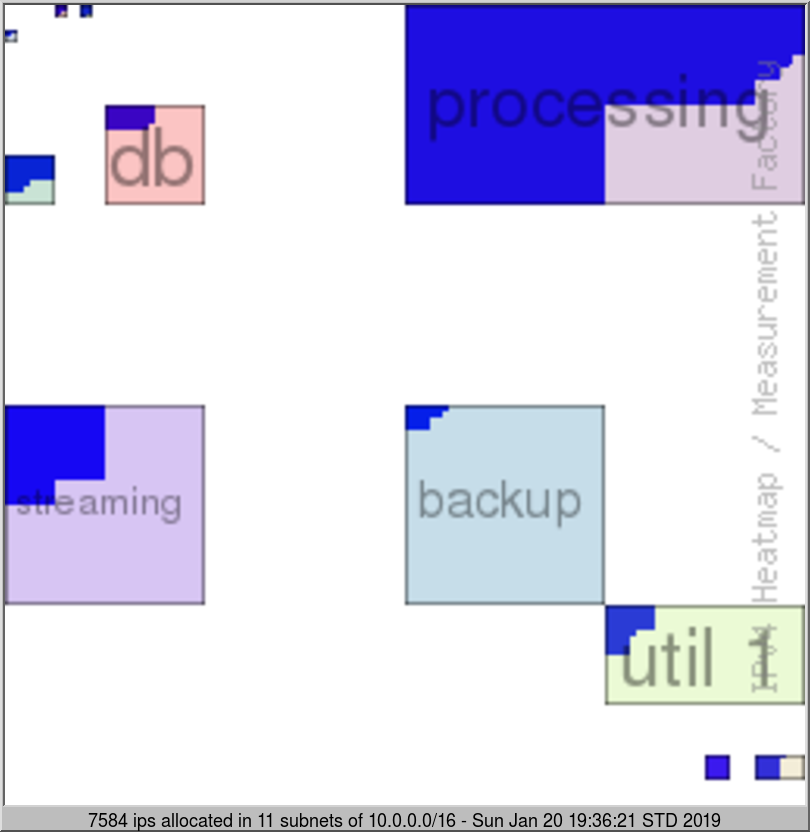

# ipviz

Transforms a list of json subnets to a heatmap png

```
Transforms a list of subnets with allocated ips in a simple heatmap png
=======================================================================
usage: ipviz.sh [OPTIONS] [-c cidr_limit] [-o output_png] input_json

OPTIONS:
    -d : Debug output
    -? : This message
    -c CIDR
       Limit the output to this CIDR
       Default to /16 subnet of the lowest IP in input
    -o output_png
       defaults to heatmap_<baseip_of_cidr>.png
input_json:
    file with json array and the following object structure:
    [
      {
        "cidr": "10.107.0.0/28",
        "available_ips": 5,
        "name": "public az1"
      },
      {
        "cidr": "10.107.0.64/28",
        "available_ips": 2,
        "name": "public az2"
      }
    ]

* each subnet is rendered as a block in the heatmap
* the allocated ips in a subnet are filled from left/top to right/down
* the free ips are rendered with a random background color in the block

Required tools installed:
 - ipv4-heatmap "make install" from: https://github.com/measurement-factory/ipv4-heatmap
 - jq
 - imagemagick
 - ipcalc
 - prips

```

## Example

Input
[Heatmap Example 1](examples/example_1.json)

Output:

